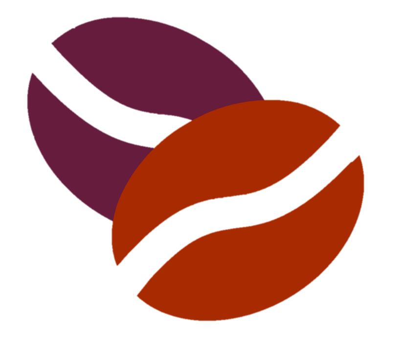

# 원두 정기 구독 페이지 — HTML & CSS 총정리 설명

> 아래는 `index.html`과 `style.css`의 **전체 코드에 상세 주석을 추가한 설명**입니다.  
> 섹션별로 HTML → CSS 순서로 설명합니다.

---

## 📄 index.html

### 0. 기본 구조 (head)

```html
<!DOCTYPE html>          <!-- HTML5 문서 선언 -->
<html lang="ko">         <!-- 문서 언어 = 한국어 (스크린리더, SEO에 영향) -->
<head>
  <meta charset="UTF-8">   <!-- 한글 깨짐 방지: UTF-8 인코딩 선언 -->
  <meta name="viewport" content="width=device-width, initial-scale=1.0">
  <!-- 모바일 반응형 필수 태그: 기기 너비에 맞게 뷰포트 설정 -->

  <title>원두 정기 구독</title>

  <!-- Font Awesome 6 아이콘 라이브러리 (CDN) -->
  <!-- fa-globe, fa-caret-down, fa-instagram 등 아이콘 사용 가능 -->
  <link rel="stylesheet" href="https://cdnjs.cloudflare.com/ajax/libs/font-awesome/6.5.1/css/all.min.css" ...>

  <link rel="stylesheet" href="style.css">   <!-- 외부 CSS 파일 연결 -->
</head>
```

---

### 1. 헤더 영역 (`<header>`)

```html
<header>
  <!-- ── 내비게이션 바 ── -->
  <nav>
    <h1 class="logo">원두정기구독</h1>   <!-- 로고 텍스트 (h1: SEO 최상위 제목) -->
    <div>
      <!-- 언어 선택 버튼: Font Awesome 아이콘 조합 -->
      <button class="lang">
        <i class="fa-solid fa-globe"></i>   <!-- 지구본 아이콘 -->
        한국어
        <i class="fa-solid fa-caret-down"></i>   <!-- 드롭다운 화살표 아이콘 -->
      </button>
      <button>로그인</button>
    </div>
  </nav>

  <!-- ── 헤더 중앙 콘텐츠 ── -->
  <!-- position: absolute + left/top 50% + transform으로 정중앙 배치 (CSS 참고) -->
  <div class="header-content">
    <h2>매일 특별한 커피 타임</h2>
    <h3>고객님의 취향에 맞게 스페셜 커피를 즐겨 보세요</h3>
    <p>이메일 주소를 보내시면 구독 안내문과 새로운 소식들을 보내 드립니다.</p>

    <!-- 이메일 구독 폼 -->
    <form class="add-email">
      <input type="email" placeholder="이메일 주소" required>
      <!-- type="email": 이메일 형식 자동 검증 -->
      <!-- required: 빈 칸 제출 방지 -->
      <button type="submit">보내기</button>
    </form>
  </div>
</header>
```

---

### 2. 배너 섹션 (`<section id="banner">`)

```html
<section id="banner">
  <!-- 보라색 그라디언트 카드 영역 -->
  <div class="banner-content">
    <h3>정성을 다해 로스팅한 커피를 매주 보내드립니다</h3>
    <p>스위커 매장의 맛있는 커피를 집에서도 즐기세요</p>
    <button>자세히 알아보기</button>
  </div>

  <h2>지금 막 로스팅했어요</h2>

  <!-- 로스팅 타입 선택 드롭다운 -->
  <select class="select-menu">
    <option value="light">라이트 로스트</option>
    <option value="medium">미디엄 로스트</option>
    <option value="dark">다크 로스트</option>
    <!-- value: 서버 전송 또는 JS에서 읽을 값 -->
  </select>
</section>
```

---

### 3. 멤버십 섹션 (`<section id="membership">`)

```html
<section id="membership">
  <h2>회원이 되시면</h2>

  <!-- 배경 이미지 + 그라디언트 오버레이 카드 (CSS에서 처리) -->
  <div class="membership-content">
    <h3>월간스위커 회원 혜택</h3>
    <p>스위커 온라인몰 구매 시 커피원두, 드립백 상품 3% 할인</p>
    <p>스위커 온라인몰 5,000원 상품권 증정</p>
  </div>
</section>
```

---

### 4. 타입별 선택 가이드 (`<section id="choice">`)

```html
<section id="choice">
  <h2>타입별 선택 가이드</h2>

  <!-- Flexbox로 카드 4개 가로 배치 (CSS: .choice-content) -->
  <div class="choice-content">

    <!-- 카드 1 -->
    <div class="card">
      <h3>너티드 커피</h3>
      <p>고소한, 구수한, 산미가 약한 커피</p>
      <div class="bean-img">
        
        <!-- alt="": 장식용 이미지이므로 빈 alt (스크린리더 무시) -->
      </div>
    </div>

    <!-- 카드 2 -->
    <div class="card">
      <h3>비비드 커피</h3>
      <p>꽃, 허브, 과일, 산미가 있는 커피</p>
      <div class="bean-img"></div>
    </div>

    <!-- 카드 3 -->
    <div class="card">
      <h3>다크 커피</h3>
      <p>쌉쌀한, 달콤한, 산미가 없는 커피</p>
      <div class="bean-img"></div>
    </div>

    <!-- 카드 4 -->
    <div class="card">
      <h3>로스터가 추천하는 커피</h3>
      <div class="bean-img"></div>
    </div>

  </div>
</section>
```

---

### 5. FAQ 아코디언 섹션 (`<section id="faq">`)

```html
<section id="faq">
  <h2>자주하는 질문과 답변</h2>

  <!-- 아코디언: CSS만으로 구현 (JavaScript 불필요) -->
  <!-- 핵심 원리: input[type="radio"]:checked + label + .content 선택자 -->
  <ul class="accordion">

    <li>
      <!-- input은 숨김 처리 (display:none), label 클릭 시 radio 체크 -->
      <input type="radio" name="accordion" id="first">
      <!-- name="accordion": 같은 그룹 → 하나만 선택 가능 (라디오 특성) -->
      <label for="first">주문은 어떻게 하나요?</label>
      <!-- for="first": label 클릭 → id="first"인 input 체크 -->
      <div class="content">
        <p>스위커 온라인몰에서 주문하시거나 000-0000-0000으로 전화해서 주문하셔도 됩니다.</p>
      </div>
    </li>

    <li>
      <input type="radio" name="accordion" id="second">
      <label for="second">주문 용량은 어떻게 되나요?</label>
      <div class="content">
        <p>고객님의 취향에 맞는 커피를 매주 또는 격주로 배송합니다. ...</p>
        <p>홈카페를 위한 100g, 200g 포장과 오피스카페를 위한 500g, 1kg 포장이 있습니다.</p>
      </div>
    </li>

    <li>
      <input type="radio" name="accordion" id="third">
      <label for="third">언제 배송되나요?</label>
      <div class="content">
        <p>매주 목요일에 배송 출발합니다. 제주도내는 금요일, 도외는 토요일에 받으실 수 있습니다.</p>
      </div>
    </li>

    <li>
      <input type="radio" name="accordion" id="fourth">
      <label for="fourth">원두 추천해 줄 수 있나요?</label>
      <div class="content">
        <p>'로스터가 추천하는 커피'를 선택하시면 상담 후 맞는 제품으로 배송해 드립니다.</p>
      </div>
    </li>

  </ul>

  <!-- FAQ 하단 뉴스레터 구독 폼 (헤더와 동일 구조) -->
  <div class="newsletter">
    <p>이메일 주소를 보내시면 구독 안내문과 새로운 소식들을 보내 드립니다.</p>
    <form class="add-email">
      <input type="email" placeholder="이메일 주소" required>
      <button type="submit">보내기</button>
    </form>
  </div>
</section>
```

---

### 6. 푸터 (`<footer>`)

```html
<footer>
  <!-- Flexbox 3단 레이아웃: left(60%) / center(20%) / right(20%) -->
  <div class="footer-content">

    <!-- 왼쪽: 내비게이션 링크 + 사업자 정보 -->
    <div class="col left">
      <ul class="footer-nav">
        <li><a href="#">매장안내</a></li>
        <li><a href="#">이용약관</a></li>
        <li><a href="#">개인정보 취급방침</a></li>
        <li><a href="#">이용안내</a></li>
        <!-- li:not(:last-child)에 border-right로 구분선 처리 (CSS 참고) -->
      </ul>
      <div class="footer-info">
        <p>상호: XXXXX (대표 : 홍길동)</p>
        <p>주소 : 제주특별자치도 제주시 해안마을 5길</p>
        <p>전화 : 000-0000-0000</p>
        <p>사업자등록번호 : 000-00-00000</p>
      </div>
    </div>

    <!-- 가운데: 고객센터 + SNS 아이콘 -->
    <div class="col center">
      <h2>고객센터</h2>
      <h3>070-000-0000</h3>
      <p>월-금 09:00-18:00</p>
      <ul class="socials">
        <!-- Font Awesome 브랜드 아이콘 사용 -->
        <li><a href="#"><i class="fa-brands fa-instagram"></i></a></li>
        <li><a href="#"><i class="fa-brands fa-square-facebook"></i></a></li>
        <li><a href="#"><i class="fa-brands fa-youtube"></i></a></li>
      </ul>
    </div>

    <!-- 오른쪽: 커뮤니티 링크 -->
    <div class="col right">
      <h2>커뮤니티</h2>
      <p><a href="#">공지사항</a></p>
      <p><a href="#">이벤트</a></p>
      <p><a href="#">상품 Q&A</a></p>
    </div>

  </div>

  <!-- 저작권 표시 -->
  <div class="copyright">
    <p>Copyright &copy; 스테이위드커피. All rights reserved.</p>
    <!-- &copy; = © 특수문자 HTML 엔터티 -->
  </div>
</footer>
```

---

## 🎨 style.css

### 0. CSS 리셋

```css
* {
  margin: 0;          /* 모든 요소의 기본 바깥 여백 제거 */
  padding: 0;         /* 모든 요소의 기본 안쪽 여백 제거 */
  box-sizing: border-box;
  /* border-box: padding과 border를 width에 포함시킴
     → 레이아웃 계산이 직관적이고 요소가 의도한 크기를 넘지 않음 */
}
```

---

### 1. 전체 적용 스타일

```css
body {
  background-color: #111;   /* 거의 검정에 가까운 다크 배경 */
  color: #fff;              /* 기본 글자색 흰색 (상속됨) */
}

section {
  padding: 40px 10%;
  /* 상하 40px, 좌우 10% 여백
     10%: 뷰포트 너비 기준 → 반응형으로 자동 조절됨 */
}

section h2 { font-size: 36px; margin-bottom: 20px; }
section h3 { font-size: 30px; font-weight: 600; margin-bottom: 20px; }
```

---

### 2. 헤더 CSS

```css
header {
  width: 100%;         /* 뷰포트 전체 너비 */
  height: 100vh;       /* 뷰포트 전체 높이 (화면 꽉 채우기) */

  /* 배경: 어두운 오버레이 + 배경 이미지 레이어드 */
  background: linear-gradient(
    rgba(0, 0, 0, 0.7),   /* 위: 70% 검정 반투명 */
    rgba(0, 0, 0, 0.7)    /* 아래: 동일 (균일한 어두움) */
  ), url(images/header-bg.jpg) center no-repeat;
  background-size: cover;  /* 이미지를 영역에 꽉 채움 (비율 유지) */

  padding: 10px 8%;
  position: relative;      /* 자식의 absolute 기준점이 됨 */
}

/* 내비게이션: 로고 왼쪽 / 버튼 오른쪽 배치 */
nav {
  display: flex;
  justify-content: space-between;   /* 양 끝 배치 */
  align-items: center;              /* 수직 중앙 정렬 */
  padding: 10px 0;
}

nav .logo {
  font-size: 32px;
  color: #db0001;     /* 브랜드 레드 컬러 */
  cursor: pointer;
}

nav button {
  border: 0; outline: 0;
  border-radius: 5px;
  background-color: #db0001;   /* 레드 버튼 */
  color: #fff;
  padding: 10px 24px;
  margin-left: 10px;           /* 버튼 간격 */
  font-size: 16px;
  cursor: pointer;
}

/* 언어 버튼: 투명 배경 + 흰 테두리 스타일 */
.lang {
  display: inline-flex;          /* 아이콘과 텍스트 가로 정렬 */
  align-items: center;
  border: 1px solid #fff;
  background-color: transparent; /* 배경 투명 → nav button 덮어씌움 */
}
.lang i:nth-child(1) { margin-right: 8px; }   /* 지구본 아이콘 오른쪽 여백 */
.lang i:nth-child(2) { margin-left: 5px; }    /* 화살표 아이콘 왼쪽 여백 */

/* 헤더 중앙 콘텐츠: 수직·수평 완전 중앙 정렬 */
.header-content {
  position: absolute;        /* 부모(header)의 relative 기준 */
  left: 50%;                 /* 왼쪽에서 50% 이동 */
  top: 50%;                  /* 위에서 50% 이동 */
  transform: translate(-50%, -50%);
  /* 요소 자신의 50%만큼 다시 위/왼쪽으로 당겨서 완전 중앙 */
  text-align: center;
}

.header-content h2 {
  font-size: 60px;
  line-height: 1.4;     /* 줄 간격 = 글자 크기의 1.4배 */
  font-weight: 600;
  max-width: 650px;     /* 너무 넓어지지 않도록 최대 너비 제한 */
  margin-bottom: 20px;
}

/* 이메일 입력 폼: 흰 배경 pill 형태 */
.add-email {
  background-color: #fff;
  border-radius: 4px;
  margin-top: 30px;
  display: flex;
  align-items: center;
  overflow: hidden;    /* 자식이 border-radius 밖으로 나가지 않도록 */
}
.add-email input {
  border: 0; outline: 0;
  flex: 1;             /* 남은 공간 모두 차지 (버튼 제외) */
  margin-left: 20px;
  color: #333;         /* 입력 텍스트는 어둡게 */
}
.add-email button {
  border: 0;
  background-color: #db0001;
  color: #fff;
  font-size: 16px;
  padding: 15px 30px;
  cursor: pointer;
}
```

---

### 3. 헤더 반응형 (`max-width: 768px`)

```css
@media only screen and (max-width: 768px) {
  /* 모바일(768px 이하)에서 헤더 재배치 */

  .logo { font-size: 20px; }          /* 로고 축소 */
  nav button { padding: 5px 10px; }   /* 버튼 여백 축소 */
  .lang { padding: 4px 8px; }

  .header-content {
    position: unset;     /* absolute 해제 → 일반 흐름으로 */
    transform: none;     /* 중앙 정렬 해제 */
    padding-top: 150px;  /* nav 아래로 밀어 내림 */
  }
  .header-content h2 {
    font-size: 48px;
    line-height: 50px;
  }
  .header-content h3 { font-size: 20px; }
  .add-email button { font-size: 12px; padding: 10px 15px; }
}
```

---

### 4. 배너 CSS

```css
.banner-content {
  border-radius: 6px;
  /* 좌에서 우로 진한 보라 → 어두운 보라 그라디언트 */
  background: linear-gradient(to right, #651c3d 0%, #280a2b 60%);
  padding: 40px;
  margin-bottom: 40px;
}
#banner p { font-size: 20px; color: rgba(255,255,255,0.7); margin-bottom: 30px; }
#banner button {
  border: 0; outline: 0; border-radius: 5px;
  background: rgba(128,128,128,0.4);  /* 반투명 회색 버튼 */
  padding: 10px 20px; color: #fff; font-size: 14px; cursor: pointer;
}

/* 드롭다운 셀렉트: 투명 배경 + 흰 테두리 */
.select-menu {
  border: 1px solid #fff;
  background-color: transparent;
  color: #fff;
  padding: 10px 24px;
  margin-top: 20px;
  font-size: 16px;
}
.select-menu option {
  background-color: #2b2b2b;  /* 옵션 열렸을 때 배경 (브라우저 기본 흰색 방지) */
  color: #fff;
}
```

---

### 5. 멤버십 CSS

```css
.membership-content {
  border-radius: 6px;
  /* 배경: 그라디언트(왼쪽 진함) + 오른쪽에 이미지 배치 */
  background: linear-gradient(
    to right,
    rgba(101, 28, 61, 0.9) 0%,    /* 왼쪽: 진한 보라빨 90% 불투명 */
    rgba(40, 10, 43, 0.5) 60%     /* 오른쪽: 점점 투명해져 이미지 보임 */
  ), url(images/membership-bg.png) no-repeat right center;
  padding: 60px 40px;
  margin-bottom: 40px;
}
```

---

### 6. 선택 가이드 CSS

```css
.choice-content {
  display: flex;
  flex-wrap: wrap;      /* 공간 부족 시 다음 줄로 넘김 */
  align-items: center;
  gap: 30px;            /* 카드 사이 간격 */
}

.card {
  flex: 1;              /* 남은 공간 균등 분배 */
  border-radius: 10px;
  /* 위: 남색 계열 → 아래: 짙은 보라 계열 그라디언트 */
  background: linear-gradient(
    to bottom,
    rgba(25,32,68,1) 0%,     /* 위: 남색 */
    rgba(32,19,34,1) 62%     /* 아래: 짙은 보라 */
  );
  padding: 40px;
  height: 300px;
  position: relative;  /* 내부 .bean-img의 absolute 기준점 */
}

/* 원두 이미지: 카드 오른쪽 하단에 절대 위치 */
.bean-img {
  width: 80px;
  position: absolute;
  bottom: 20px;
  right: 10px;
}
.bean-img img { width: 100%; height: auto; }

/* ── 반응형 (선택 가이드) ── */
@media only screen and (max-width: 768px) {
  .card { flex-basis: 100%; }   /* 모바일: 카드 1개씩 전체 너비 */
}
@media only screen and (min-width: 769px) and (max-width: 1220px) {
  .card { flex-basis: calc(50% - 15px); }
  /* 태블릿: 2열 배치 (gap 30px의 절반 = 15px 빼줌) */
}
```

---

### 7. FAQ 아코디언 CSS ⭐ (핵심 트릭)

```css
/* ── 아코디언 핵심 원리 ──
   JavaScript 없이 CSS :checked 선택자만으로 열고 닫기 구현
   흐름: label 클릭 → radio input 체크 → CSS가 .content를 펼침
*/

.accordion li label {
  display: flex; align-items: center;
  padding: 20px;
  font-size: 25px; font-weight: 500;
  background: #303030;
  margin-bottom: 2px;
  cursor: pointer;
  position: relative;   /* ::after 가상 요소 위치 기준 */
}

/* '+' 아이콘: 유니코드 문자로 추가 */
.accordion li label::after {
  content: '\2b';       /* ✚ (덧셈 기호 유니코드) */
  font-size: 40px;
  position: absolute;
  right: 20px;
  transition: 0.5s;     /* 회전 애니메이션 */
}

/* radio input 자체는 숨김 */
.accordion input[type="radio"] { display: none; }

/* 콘텐츠 기본: 높이 0 → 숨김 */
.accordion .content {
  background: #3b3b3b;
  font-size: 22px; line-height: 1.6;
  padding: 0 20px;
  max-height: 0;        /* 높이 0: 보이지 않음 */
  overflow: hidden;     /* 넘친 내용 숨김 */
}

/* ★ 핵심: 체크된 라디오 바로 다음 label 바로 다음 .content */
.accordion input[type="radio"]:checked + label + .content {
  max-height: 600px;    /* 충분히 큰 값으로 펼침 */
  padding: 30px 20px;   /* 패딩도 함께 나타남 */
}

/* ★ 핵심: 체크 시 '+' → 'x' 형태로 회전 */
.accordion input[type="radio"]:checked + label::after {
  transform: rotate(-135deg);   /* 45도 × */
}
```

---

### 8. 푸터 CSS

```css
footer { padding: 60px 10%; }

.footer-content {
  display: flex;
  justify-content: space-between;
  align-items: start;   /* 각 열 상단 정렬 */
  gap: 30px;
}

.footer-content a {
  color: rgba(255,255,255,0.7);  /* 반투명 흰색 링크 */
  text-decoration: none;          /* 밑줄 제거 */
}

/* 3열 너비 비율: 60% / 20% / 20% */
.left  { flex-basis: 60%; }
.center, .right { flex-basis: 20%; vertical-align: top; }

/* 내비게이션 링크 가로 나열 */
.footer-nav {
  display: flex; justify-content: start;
  align-items: center; gap: 20px;
  list-style: none; margin-bottom: 40px;
}

/* 마지막 li 제외 오른쪽에 구분선 */
.footer-nav li:not(:last-child) {
  padding-right: 20px;
  border-right: 1px solid #eee;
}

/* SNS 아이콘 가로 나열 */
.socials {
  display: flex; justify-content: start;
  align-items: center; gap: 10px;
  list-style: none;
}

/* 반응형 (푸터): 모바일에서 세로 스택 */
@media only screen and (max-width: 768px) {
  .footer-content {
    display: flex;
    flex-direction: column;   /* 세로 방향으로 전환 */
  }
  .col { flex-basis: 100%; }  /* 각 열 전체 너비 */
}
```

---

## 💡 핵심 개념 요약

| 개념 | 사용 위치 | 핵심 포인트 |
|------|-----------|------------|
| `position: absolute` + `transform: translate(-50%,-50%)` | 헤더 중앙 콘텐츠 | 부모에 `position:relative` 필수 |
| `linear-gradient` + `url()` 레이어드 배경 | 헤더, 멤버십 | 콤마로 레이어 구분, 앞이 위에 |
| `flex: 1` + `gap` | 카드 레이아웃 | 균등 분배 + 여백 |
| `max-height: 0 → 600px` + `overflow: hidden` | FAQ 아코디언 | JS 없이 CSS만으로 열고 닫기 |
| `:checked + label + .content` | FAQ 아코디언 | 인접 형제 결합자(+) 체인 |
| `@media only screen and (max-width: 768px)` | 반응형 | 모바일 우선 or 데스크탑 우선 선택 |
| `background-size: cover` | 헤더 배경 이미지 | 비율 유지하며 영역 꽉 채움 |
| `flex-basis: calc(50% - 15px)` | 태블릿 2열 | gap 절반을 빼서 정확한 2열 |
